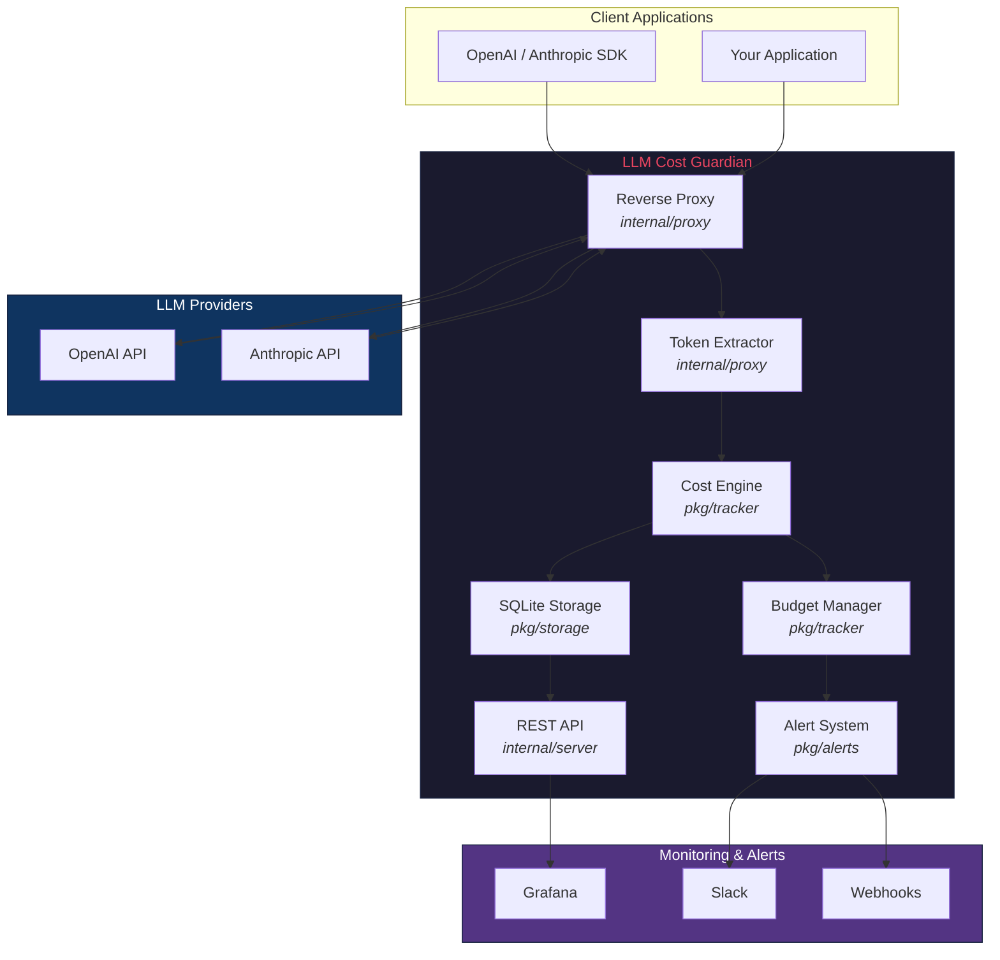
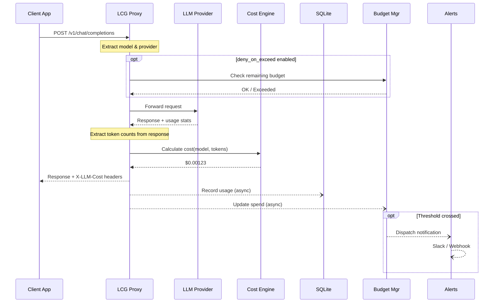
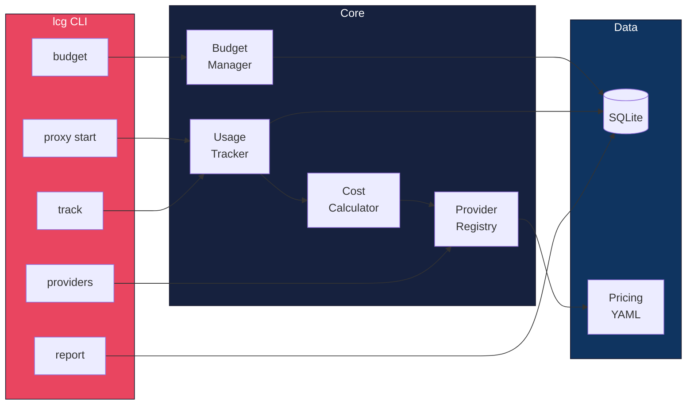

<div align="center">

# LLM Cost Guardian

### Multi-Provider LLM Cost Tracking, Budgeting & Optimization

**Track every token. Control every dollar. Optimize every model choice.**

[](https://github.com/ogulcanaydogan/LLM-Cost-Guardian/actions/workflows/ci.yml)
[](https://goreportcard.com/report/github.com/ogulcanaydogan/LLM-Cost-Guardian)
[](https://github.com/ogulcanaydogan/LLM-Cost-Guardian)
[](https://go.dev/)
[](LICENSE)
[](deploy/docker/Dockerfile)

---

[About](#about) · [Features](#features) · [Architecture](#architecture) · [Quick Start](#quick-start) · [CLI Reference](#cli-reference) · [Proxy Mode](#proxy-mode) · [Configuration](#configuration) · [Grafana Dashboard](#grafana-dashboard) · [Benchmarks](#benchmarks) · [Roadmap](#roadmap)

</div>

---

## About

Organizations running LLM workloads across multiple providers (OpenAI, Anthropic, Azure, Bedrock) face a critical blind spot: **cost visibility**. Token-based pricing, model proliferation, and decentralized usage patterns make it nearly impossible to answer basic questions — _How much did we spend last week? Which model is most cost-efficient? Are we within budget?_

LLM Cost Guardian solves this by providing a **transparent cost tracking layer** that sits between your applications and LLM providers. It intercepts API calls, counts tokens, calculates costs using up-to-date pricing data, enforces budget limits, and sends alerts — all with sub-10ms overhead.

### Why LLM Cost Guardian?

| Problem | Solution |
|---------|----------|
| No unified view of LLM spend across providers | Single dashboard with per-provider, per-model, per-project breakdowns |
| Unexpected cost spikes from runaway workloads | Budget limits with configurable alerts at threshold crossings |
| Manual token counting and cost estimation | Automatic cost calculation using YAML-based pricing data |
| Vendor lock-in for cost monitoring | Open-source, self-hosted, works with any provider |
| Complex integration requirements | Drop-in transparent proxy — change one URL, track everything |

### Project Highlights

| Metric | Value |
|--------|-------|
| Supported Providers | OpenAI, Anthropic (Azure, Bedrock planned) |
| Tracked Models | 13+ with extensible YAML pricing |
| Proxy Latency Overhead | < 10ms |
| Storage | SQLite (WAL mode, CGO-free) |
| Build Targets | 6 platforms (linux/darwin/windows × amd64/arm64) |
| Test Coverage | ≥ 80% (CI-enforced) |

---

## Features

<table>
<tr>
<td width="50%">

**Cost Tracking**
- Automatic cost calculation per API call
- Per-provider, per-model pricing (YAML-based)
- Token counting via tiktoken (OpenAI) and estimation
- Project-level cost attribution

</td>
<td width="50%">

**Budget Management**
- Daily, weekly, and monthly spending limits
- Configurable alert thresholds (e.g., 80%, 95%)
- Optional request blocking when budget exceeded
- Multi-budget support for different teams/projects

</td>
</tr>
<tr>
<td>

**Transparent Proxy**
- Drop-in reverse proxy for LLM APIs
- Cost headers injected into every response
- Automatic provider detection from request URL
- Non-blocking async usage recording

</td>
<td>

**Alerting & Monitoring**
- Slack webhook notifications
- Generic HTTP webhooks with HMAC signing
- Grafana dashboard template included
- REST API for custom integrations

</td>
</tr>
</table>

---

## Architecture

### System Overview



### Cost Tracking Pipeline



### CLI Command Flow



### Package Structure

```
llm-cost-guardian/
├── cmd/
│   ├── guardian/              # Proxy service entry point
│   └── lcg/                   # CLI entry point
├── internal/
│   ├── cli/                   # Cobra CLI commands
│   ├── config/                # Viper configuration
│   ├── proxy/                 # Reverse proxy + token extraction
│   └── server/                # REST API server
├── pkg/
│   ├── alerts/                # Slack & webhook notifiers
│   ├── model/                 # Shared domain types
│   ├── providers/             # Provider interface & implementations
│   ├── storage/               # SQLite storage layer
│   ├── tokenizer/             # Token counting (tiktoken + estimation)
│   └── tracker/               # Cost calculator, usage tracker, budget mgr
├── pricing/                   # YAML pricing data
├── grafana/dashboards/        # Grafana dashboard template
├── deploy/docker/             # Dockerfile
├── docs/                      # Extended documentation
└── tests/                     # Integration tests & fixtures
```

### Module Map

| Package | Responsibility | Key Types |
|---------|---------------|-----------|
| `pkg/providers` | Provider pricing data, cost-per-token lookups | `Provider`, `Registry`, `ModelPricing` |
| `pkg/tokenizer` | Token counting (tiktoken for OpenAI, estimation for others) | `CountTokens`, `CountChatTokens` |
| `pkg/tracker` | Cost calculation, usage recording, budget enforcement | `UsageTracker`, `CostCalculator`, `BudgetManager` |
| `pkg/storage` | SQLite persistence with WAL mode | `Storage`, `SQLite` |
| `pkg/alerts` | Alert delivery via Slack and generic webhooks | `Notifier`, `SlackNotifier`, `WebhookNotifier` |
| `pkg/model` | Shared domain types (records, budgets, filters) | `UsageRecord`, `Budget`, `ReportFilter` |
| `internal/proxy` | Transparent reverse proxy with cost middleware | `Handler`, `ExtractRequestInfo` |
| `internal/config` | Configuration loading (file + env vars) | `Config`, `Load` |

---

## Quick Start

### Install

```bash
# From source
go install github.com/ogulcanaydogan/LLM-Cost-Guardian/cmd/lcg@latest

# Or build locally
git clone https://github.com/ogulcanaydogan/LLM-Cost-Guardian.git
cd LLM-Cost-Guardian
make build
```

### Track Usage (CLI)

```bash
# Record a single API call
lcg track --provider openai --model gpt-4o \
  --input-tokens 1000 --output-tokens 500 \
  --project my-app

# Output:
# Recorded usage:
#   ID:            a1b2c3d4-...
#   Provider:      openai
#   Model:         gpt-4o
#   Input tokens:  1000
#   Output tokens: 500
#   Cost:          $0.007500
#   Project:       my-app
```

### Start Proxy

```bash
# Start the transparent proxy
lcg proxy start --listen :8080

# Point your SDK to the proxy
export OPENAI_BASE_URL=http://localhost:8080

# Every API call is now automatically tracked with cost headers:
# X-LLM-Cost: 0.007500
# X-LLM-Input-Tokens: 1000
# X-LLM-Output-Tokens: 500
```

### Set Budget

```bash
# Set a monthly budget of $100 with alert at 80%
lcg budget set --name production --limit 100 --period monthly --alert-at 80

# Check budget status
lcg budget status
# NAME        PERIOD   LIMIT    SPENT   REMAINING  USAGE    ALERT AT
# production  monthly  $100.00  $23.45  $76.55     23.5%    80%
```

### Generate Report

```bash
# Daily cost report
lcg report --period daily

# Monthly report filtered by provider
lcg report --period monthly --provider openai --detailed
```

### List Providers & Pricing

```bash
lcg providers list
# PROVIDER   MODEL               INPUT ($/1M)  OUTPUT ($/1M)  CACHED INPUT ($/1M)
# openai     gpt-4o              $2.50         $10.00         -
# openai     gpt-4o-mini         $0.15         $0.60          -
# openai     o3-mini             $1.10         $4.40          -
# anthropic  claude-3.5-sonnet   $3.00         $15.00         $0.30
# anthropic  claude-3-haiku      $0.25         $1.25          $0.03
```

---

## CLI Reference

| Command | Description |
|---------|------------|
| `lcg track` | Record LLM API usage manually |
| `lcg report` | Generate usage and cost reports |
| `lcg budget set` | Create or update a spending budget |
| `lcg budget status` | Show current budget utilization |
| `lcg providers list` | List all providers and model pricing |
| `lcg proxy start` | Start the transparent cost tracking proxy |
| `lcg version` | Print the version |

### Global Flags

| Flag | Description |
|------|------------|
| `--config` | Path to config file (default: `~/.lcg/config.yaml`) |

---

## Proxy Mode

The proxy operates as a transparent HTTP reverse proxy. Clients send requests with an `X-LCG-Target` header specifying the upstream LLM API URL.

### Integration

```python
import openai

# Point the SDK to the LCG proxy
client = openai.OpenAI(
    base_url="http://localhost:8080/v1",
    api_key="your-api-key",
    default_headers={
        "X-LCG-Target": "https://api.openai.com/v1/chat/completions",
        "X-LCG-Project": "my-app",
    }
)

response = client.chat.completions.create(
    model="gpt-4o",
    messages=[{"role": "user", "content": "Hello"}]
)

# Cost is available in response headers
```

### Response Headers

| Header | Description | Example |
|--------|------------|---------|
| `X-LLM-Cost` | Total cost in USD | `0.007500` |
| `X-LLM-Input-Tokens` | Input token count | `1000` |
| `X-LLM-Output-Tokens` | Output token count | `500` |
| `X-LLM-Provider` | Detected provider | `openai` |
| `X-LLM-Model` | Model used | `gpt-4o` |
| `X-LCG-Latency` | Proxy overhead | `2.1ms` |

### Request Headers

| Header | Required | Description |
|--------|----------|------------|
| `X-LCG-Target` | Yes | Upstream API URL |
| `X-LCG-Provider` | No | Override provider detection |
| `X-LCG-Project` | No | Project name for attribution |

---

## Configuration

See [config.example.yaml](config.example.yaml) for the full reference.

```yaml
storage:
  path: ~/.lcg/guardian.db

proxy:
  listen: ":8080"
  deny_on_exceed: false
  add_cost_headers: true

alerts:
  slack:
    enabled: true
    webhook_url: "https://hooks.slack.com/services/..."
    channel: "#llm-costs"

pricing:
  dir: pricing/

defaults:
  project: default
```

Environment variables override config file values with the `LCG_` prefix:

```bash
export LCG_PROXY_LISTEN=":9090"
export LCG_ALERTS_SLACK_ENABLED=true
export LCG_LOGGING_LEVEL=debug
```

Full configuration reference: [docs/configuration.md](docs/configuration.md)

---

## Grafana Dashboard

A pre-built Grafana dashboard is included at [`grafana/dashboards/llm-costs.json`](grafana/dashboards/llm-costs.json).

**Panels included:**
- Total spend (30-day stat)
- Daily spend trend (time series)
- Spend by provider (pie chart)
- Top models by cost (bar chart)
- Cost by project (table)
- Budget utilization (table with status)

Import the dashboard JSON into Grafana and configure the SQLite datasource pointing to your `guardian.db` file.

---

## Benchmarks

Measured on Apple M3 Pro, Go 1.25.

| Operation | Time | Allocs |
|-----------|------|--------|
| Cost calculation (single call) | ~50ns | 0 |
| Token counting — tiktoken (short) | ~15μs | ~5 |
| Token counting — estimation | ~20ns | 0 |
| Proxy overhead (end-to-end) | < 5ms | - |
| SQLite write (single record) | ~200μs | ~10 |

The proxy adds **< 10ms** of latency overhead per request, dominated by response body capture and SQLite write. Usage recording is asynchronous and does not block the response.

---

## CI/CD Pipeline

```
Lint (golangci-lint)
    │
    ▼
Test (race detector + 80% coverage gate)
    │
    ▼
Benchmark
    │
    ▼
Build (6 platforms: linux/darwin/windows × amd64/arm64)
    │
    ▼
Release (on v* tags → GitHub Releases with checksums)
```

---

## Roadmap

### Phase 1 — Core ✅
- [x] Provider interfaces (OpenAI, Anthropic)
- [x] Token counting logic (tiktoken + estimation)
- [x] Cost calculation engine
- [x] SQLite storage (WAL mode)
- [x] CLI: `lcg track`, `lcg report`, `lcg budget`, `lcg providers`
- [x] Transparent proxy mode with cost headers
- [x] Budget limits & threshold alerts
- [x] Slack webhook integration
- [x] Grafana dashboard template

### Phase 2 — Enterprise Features
- [ ] Multi-tenant support with team isolation
- [ ] Azure OpenAI provider
- [ ] AWS Bedrock provider
- [ ] Google Vertex AI provider
- [ ] Python SDK
- [ ] TypeScript SDK
- [ ] Chargeback reports (CSV/PDF export)
- [ ] Prometheus metrics endpoint

### Phase 3 — Intelligence
- [ ] Cost anomaly detection (statistical + ML)
- [ ] Model recommendation engine
- [ ] Prompt optimization suggestions
- [ ] Usage forecasting
- [ ] Streaming response support (SSE)
- [ ] v1.0.0 release

---

## Documentation

| Document | Description |
|----------|------------|
| [Architecture](docs/architecture.md) | System design and component overview |
| [Configuration](docs/configuration.md) | Full configuration reference |
| [config.example.yaml](config.example.yaml) | Example configuration file |

---

## License

Apache License 2.0 — see [LICENSE](LICENSE) for details.

<div align="center">

Copyright 2026 [Ogulcan Aydogan](https://github.com/ogulcanaydogan)

</div>
