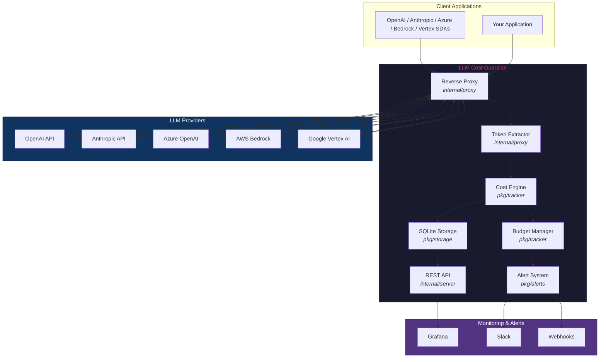
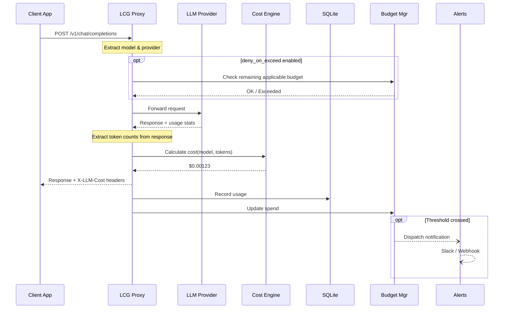
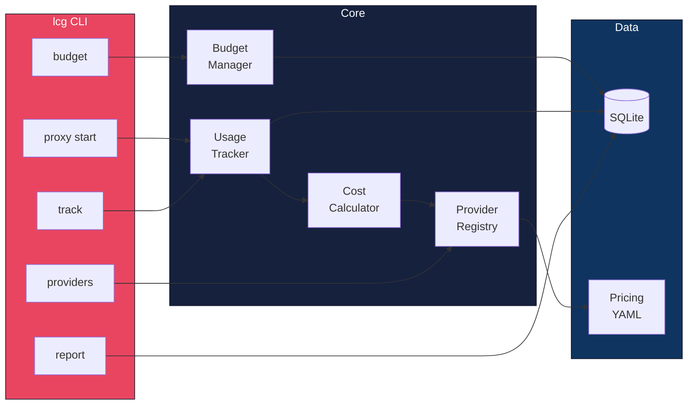

<div align="center">
[](https://www.bestpractices.dev/projects/12190)

# LLM Cost Guardian

### Multi-Provider LLM Cost Tracking, Budgeting & Optimization

**Track every token. Control every dollar. Optimize every model choice.**

[](https://github.com/ogulcanaydogan/LLM-Cost-Guardian/actions/workflows/ci.yml)
[](https://goreportcard.com/report/github.com/ogulcanaydogan/LLM-Cost-Guardian)
[](https://github.com/ogulcanaydogan/LLM-Cost-Guardian)
[](https://go.dev/)
[](LICENSE)
[](deploy/docker/Dockerfile)

---

[About](#about) · [Features](#features) · [Architecture](#architecture) · [Quick Start](#quick-start) · [CLI Reference](#cli-reference) · [Proxy Mode](#proxy-mode) · [Configuration](#configuration) · [Grafana Dashboard](#grafana-dashboard) · [Benchmarks](#benchmarks) · [Roadmap](#roadmap)

</div>

---

## About

Organizations running LLM workloads across multiple providers (OpenAI, Anthropic, Azure OpenAI, Bedrock, Vertex AI) face a critical blind spot: **cost visibility**. Token-based pricing, model proliferation, and decentralized usage patterns make it nearly impossible to answer basic questions — _How much did we spend last week? Which model is most cost-efficient? Are we within budget?_

LLM Cost Guardian solves this by providing a **transparent cost tracking layer** that sits between your applications and LLM providers. It intercepts API calls, counts tokens, calculates costs using up-to-date pricing data, enforces budget limits, and sends alerts — all with sub-10ms overhead.

### Why LLM Cost Guardian?

| Problem | Solution |
|---------|----------|
| No unified view of LLM spend across providers | Single dashboard with per-provider, per-model, per-project breakdowns |
| Unexpected cost spikes from runaway workloads | Budget limits with configurable alerts at threshold crossings |
| Manual token counting and cost estimation | Automatic cost calculation using YAML-based pricing data |
| Vendor lock-in for cost monitoring | Open-source, self-hosted, works with any provider |
| Complex integration requirements | Drop-in transparent proxy — change one URL, track everything |

### Project Highlights

| Metric | Value |
|--------|-------|
| Supported Providers | OpenAI, Anthropic, Azure OpenAI, AWS Bedrock, Google Vertex AI |
| Tracked Models | 20+ with extensible YAML pricing |
| Proxy Latency Overhead | < 10ms |
| Storage | SQLite (WAL mode, CGO-free) |
| Build Targets | 6 platforms (linux/darwin/windows × amd64/arm64) |
| Test Coverage | ≥ 80% (CI-enforced) |

---

## Features

<table>
<tr>
<td width="50%">

**Cost Tracking**
- Automatic cost calculation per API call
- Per-provider, per-model pricing (YAML-based)
- Token counting via tiktoken (OpenAI) and estimation
- Tenant and project-level cost attribution

</td>
<td width="50%">

**Budget Management**
- Daily, weekly, and monthly spending limits
- Tenant-global and tenant-project budget support
- Configurable alert thresholds (e.g., 80%, 95%)
- Optional request blocking when budget exceeded
- API-key based tenant isolation

</td>
</tr>
<tr>
<td>

**Transparent Proxy**
- Drop-in reverse proxy for LLM APIs
- Cost headers injected into non-streaming responses
- Automatic provider detection from request URL
- Explicit provider overrides via `X-LCG-Provider`
- Request body limits enforced before upstream calls
- Live SSE passthrough with end-of-stream usage capture

</td>
<td>

**Alerting & Monitoring**
- Slack webhook notifications
- Generic HTTP webhooks with HMAC signing
- Prometheus-compatible `/metrics` endpoint
- JSON API for reports and analytics
- Anomaly detection, forecasting, recommendations, and prompt optimization insights

</td>
</tr>
</table>

---

## Architecture

### System Overview


```mermaid
flowchart TB
    subgraph Clients["Client Applications"]
        SDK["OpenAI / Anthropic / Azure / Bedrock / Vertex SDKs"]
        App["Your Application"]
    end

    subgraph LCG["LLM Cost Guardian"]
        direction TB
        Proxy["Reverse Proxy<br/><i>internal/proxy</i>"]
        Extract["Token Extractor<br/><i>internal/proxy</i>"]
        Cost["Cost Engine<br/><i>pkg/tracker</i>"]
        Budget["Budget Manager<br/><i>pkg/tracker</i>"]
        Store["SQLite Storage<br/><i>pkg/storage</i>"]
        Alert["Alert System<br/><i>pkg/alerts</i>"]
        API["REST API<br/><i>internal/server</i>"]

        Proxy --> Extract
        Extract --> Cost
        Cost --> Store
        Cost --> Budget
        Budget --> Alert
        Store --> API
    end

    subgraph Providers["LLM Providers"]
        OpenAI["OpenAI API"]
        Anthropic["Anthropic API"]
        Azure["Azure OpenAI"]
        Bedrock["AWS Bedrock"]
        Vertex["Google Vertex AI"]
    end

    subgraph Monitoring["Monitoring & Alerts"]
        Grafana["Grafana"]
        Slack["Slack"]
        Webhook["Webhooks"]
    end

    SDK --> Proxy
    App --> Proxy
    Proxy --> OpenAI
    Proxy --> Anthropic
    Proxy --> Azure
    Proxy --> Bedrock
    Proxy --> Vertex
    OpenAI --> Proxy
    Anthropic --> Proxy
    Azure --> Proxy
    Bedrock --> Proxy
    Vertex --> Proxy

    API --> Grafana
    Alert --> Slack
    Alert --> Webhook

    style LCG fill:#1a1a2e,stroke:#16213e,color:#e94560
    style Providers fill:#0f3460,stroke:#16213e,color:#fff
    style Monitoring fill:#533483,stroke:#16213e,color:#fff
```

### Cost Tracking Pipeline


```mermaid
sequenceDiagram
    participant App as Client App
    participant Proxy as LCG Proxy
    participant LLM as LLM Provider
    participant Engine as Cost Engine
    participant DB as SQLite
    participant Budget as Budget Mgr
    participant Alert as Alerts

    App->>Proxy: POST /v1/chat/completions
    Note over Proxy: Extract model & provider

    opt deny_on_exceed enabled
        Proxy->>Budget: Check remaining applicable budget
        Budget-->>Proxy: OK / Exceeded
    end

    Proxy->>LLM: Forward request
    LLM-->>Proxy: Response + usage stats

    Note over Proxy: Extract token counts from response

    Proxy->>Engine: Calculate cost(model, tokens)
    Engine-->>Proxy: $0.00123

    Proxy-->>App: Response + X-LLM-Cost headers

    Proxy->>DB: Record usage
    Proxy->>Budget: Update spend

    opt Threshold crossed
        Budget--)Alert: Dispatch notification
        Alert--)Alert: Slack / Webhook
    end
```

### CLI Command Flow


```mermaid
flowchart LR
    subgraph CLI["lcg CLI"]
        track["track"]
        report["report"]
        budget["budget"]
        prov["providers"]
        proxy["proxy start"]
    end

    subgraph Core["Core"]
        Registry["Provider<br/>Registry"]
        Calc["Cost<br/>Calculator"]
        Tracker["Usage<br/>Tracker"]
        BudgetMgr["Budget<br/>Manager"]
    end

    subgraph Data["Data"]
        SQLite[("SQLite")]
        YAML["Pricing<br/>YAML"]
    end

    track --> Tracker
    report --> SQLite
    budget --> BudgetMgr
    prov --> Registry
    proxy --> Tracker

    Registry --> YAML
    Tracker --> Calc
    Calc --> Registry
    Tracker --> SQLite
    BudgetMgr --> SQLite

    style CLI fill:#e94560,stroke:#1a1a2e,color:#fff
    style Core fill:#16213e,stroke:#1a1a2e,color:#fff
    style Data fill:#0f3460,stroke:#1a1a2e,color:#fff
```

### Package Structure

```
llm-cost-guardian/
├── cmd/
│   ├── guardian/              # Proxy service entry point
│   └── lcg/                   # CLI entry point
├── internal/
│   ├── cli/                   # Cobra CLI commands
│   ├── config/                # Viper configuration
│   ├── proxy/                 # Reverse proxy + token extraction
│   ├── reporting/             # CSV/PDF export helpers
│   └── server/                # REST API server
├── pkg/
│   ├── alerts/                # Slack & webhook notifiers
│   ├── model/                 # Shared domain types
│   ├── providers/             # Provider interface & implementations
│   ├── storage/               # SQLite storage layer
│   ├── tokenizer/             # Token counting (tiktoken + estimation)
│   └── tracker/               # Cost calculator, usage tracker, budget mgr
├── pricing/                   # YAML pricing data
├── sdk/typescript/            # TypeScript SDK package
├── grafana/dashboards/        # Grafana dashboard template
├── deploy/docker/             # Dockerfile
├── docs/                      # Extended documentation
└── tests/                     # Integration tests & fixtures
```

### Module Map

| Package | Responsibility | Key Types |
|---------|---------------|-----------|
| `pkg/providers` | Provider pricing data, cost-per-token lookups | `Provider`, `Registry`, `ModelPricing` |
| `pkg/tokenizer` | Token counting (tiktoken for OpenAI, estimation for others) | `CountTokens`, `CountChatTokens` |
| `pkg/tracker` | Cost calculation, usage recording, budget enforcement | `UsageTracker`, `CostCalculator`, `BudgetManager` |
| `pkg/storage` | SQLite persistence with WAL mode | `Storage`, `SQLite` |
| `pkg/alerts` | Alert delivery via Slack and generic webhooks | `Notifier`, `SlackNotifier`, `WebhookNotifier` |
| `pkg/model` | Shared domain types (records, budgets, filters) | `UsageRecord`, `Budget`, `ReportFilter` |
| `internal/proxy` | Transparent reverse proxy with cost middleware | `Handler`, `ExtractRequestInfo` |
| `internal/config` | Configuration loading (file + env vars) | `Config`, `Load` |

---

## Quick Start

### Install

```bash
# From source
go install github.com/ogulcanaydogan/LLM-Cost-Guardian/cmd/lcg@latest

# Or build locally
git clone https://github.com/ogulcanaydogan/LLM-Cost-Guardian.git
cd LLM-Cost-Guardian
make build
```

### Track Usage (CLI)

```bash
# Record a single API call
lcg track --provider openai --model gpt-4o \
  --input-tokens 1000 --output-tokens 500 \
  --project my-app

# Output:
# Recorded usage:
#   ID:            a1b2c3d4-...
#   Provider:      openai
#   Model:         gpt-4o
#   Input tokens:  1000
#   Output tokens: 500
#   Cost:          $0.007500
#   Project:       my-app
```

### Start Proxy

```bash
# Start the transparent proxy
lcg proxy start --listen :8080

# Point your SDK to the proxy
export OPENAI_BASE_URL=http://localhost:8080

# Every API call is now automatically tracked with cost headers:
# X-LLM-Cost: 0.007500
# X-LLM-Input-Tokens: 1000
# X-LLM-Output-Tokens: 500
```

### Set Budget

```bash
# Set a monthly budget of $100 for a specific project with alert at 80%
lcg budget set --name production --project my-app --limit 100 --period monthly --alert-at 80

# Check budget status
lcg budget status --project my-app
# NAME          SCOPE           PERIOD   LIMIT    SPENT   REMAINING  USAGE    ALERT AT
# production    project:my-app  monthly  $100.00  $23.45  $76.55     23.5%    80%
# global-cap    global          monthly  $250.00  $23.45  $226.55    9.4%     80%
```

### Generate Report

```bash
# Daily cost report
lcg report --period daily

# Monthly report filtered by provider
lcg report --period monthly --provider openai --detailed

# Chargeback export by project
lcg report --period monthly --format csv --output output/csv/monthly-chargeback.csv
lcg report --period monthly --format pdf --output output/pdf/monthly-chargeback.pdf
```

### List Providers & Pricing

```bash
lcg providers list
# PROVIDER   MODEL               INPUT ($/1M)  OUTPUT ($/1M)  CACHED INPUT ($/1M)
# openai     gpt-4o              $2.50         $10.00         -
# openai     gpt-4o-mini         $0.15         $0.60          -
# openai     o3-mini             $1.10         $4.40          -
# anthropic  claude-3.5-sonnet   $3.00         $15.00         $0.30
# anthropic  claude-3-haiku      $0.25         $1.25          $0.03
# azure-openai gpt-4o            $2.50         $10.00         -
# bedrock   anthropic.claude...  $3.00         $15.00         $0.30
# vertex-ai gemini-1.5-pro       $1.25         $5.00          -
```

---

## CLI Reference

| Command | Description |
|---------|------------|
| `lcg track` | Record LLM API usage manually |
| `lcg report` | Generate usage and cost reports |
| `lcg budget set` | Create or update a spending budget |
| `lcg budget status` | Show current budget utilization |
| `lcg tenants` | Create, list, and disable tenants |
| `lcg api-keys` | Create, list, and revoke tenant API keys |
| `lcg anomalies` | Show spend anomalies |
| `lcg forecast` | Forecast 7-day and 30-day spend |
| `lcg recommend` | Suggest lower-cost model alternatives |
| `lcg prompts optimize` | Show prompt efficiency suggestions |
| `lcg providers list` | List all providers and model pricing |
| `lcg proxy start` | Start the transparent cost tracking proxy |
| `lcg version` | Print the version |

### Global Flags

| Flag | Description |
|------|------------|
| `--config` | Path to config file (default: `~/.lcg/config.yaml`) |

---

## Proxy Mode

The proxy operates as a transparent HTTP reverse proxy. Clients send requests with an `X-LCG-Target` header specifying the upstream LLM API URL.

### Integration

```python
import openai

# Point the SDK to the LCG proxy
client = openai.OpenAI(
    base_url="http://localhost:8080/v1",
    api_key="your-api-key",
    default_headers={
        "X-LCG-API-Key": "lcg_tenant_key",
        "X-LCG-Target": "https://api.openai.com/v1/chat/completions",
        "X-LCG-Project": "my-app",
    }
)

response = client.chat.completions.create(
    model="gpt-4o",
    messages=[{"role": "user", "content": "Hello"}]
)

# Cost is available in response headers
```

### Response Headers

| Header | Description | Example |
|--------|------------|---------|
| `X-LLM-Cost` | Total cost in USD | `0.007500` |
| `X-LLM-Input-Tokens` | Input token count | `1000` |
| `X-LLM-Output-Tokens` | Output token count | `500` |
| `X-LLM-Provider` | Detected provider | `openai` |
| `X-LLM-Model` | Model used | `gpt-4o` |
| `X-LCG-Latency` | Proxy overhead | `2.1ms` |
| `X-LCG-Streaming` | Present on streaming passthrough responses | `true` |

### Request Headers

| Header | Required | Description |
|--------|----------|------------|
| `X-LCG-Target` | Yes | Upstream API URL |
| `X-LCG-API-Key` | When multi-tenant auth is enabled | Tenant API key for LCG |
| `X-LCG-Provider` | No | Explicitly override provider detection |
| `X-LCG-Project` | No | Project name for attribution |

`Authorization: Bearer <key>` is also accepted for LCG auth, but `X-LCG-API-Key` is safer for proxy traffic because it avoids clobbering upstream provider credentials.

Streaming requests are passed through live. When the upstream stream exposes terminal usage, LCG records exact tokens; otherwise it falls back to prompt/output estimation and still writes the final usage row.

---

## JSON API

The built-in server exposes a small JSON API alongside proxy mode:

| Endpoint | Description |
|----------|-------------|
| `GET /healthz` | Liveness check returning `{"status":"ok"}` |
| `GET /metrics` | Prometheus-compatible counters for requests, tokens, and spend with `tenant`, `provider`, `model`, and `project` labels |
| `GET /api/v1/usage` | Raw usage records with optional `tenant`, `provider`, `model`, and `project` filters |
| `GET /api/v1/summary` | Aggregated usage summary for `daily`, `weekly`, or `monthly` periods including tenant, provider, model, and project breakdowns |
| `GET /api/v1/anomalies` | Spend anomaly detection results |
| `GET /api/v1/forecast` | 7-day and 30-day spend forecasts |
| `GET /api/v1/recommendations` | Lower-cost model recommendations for observed workloads |
| `GET /api/v1/prompt-optimizations` | Prompt efficiency suggestions derived from request metadata |

## TypeScript SDK

The repository now includes a TypeScript SDK package under [`sdk/typescript`](sdk/typescript).

```ts
import { LCGClient } from "@ogulcanaydogan/llm-cost-guardian";

const client = new LCGClient({
  baseUrl: "http://127.0.0.1:8080",
  apiKey: "lcg_tenant_key",
  defaultProject: "payments",
  defaultTenant: "default"
});

const summary = await client.summary({ period: "daily" });
const anomalies = await client.anomalies({ tenant: "default" });

await client.proxyFetch({
  path: "/v1/chat/completions",
  target: "https://api.openai.com/v1/chat/completions",
  provider: "openai",
  requestInit: {
    method: "POST",
    headers: {
      Authorization: `Bearer ${process.env.OPENAI_API_KEY ?? ""}`,
      "Content-Type": "application/json"
    },
    body: JSON.stringify({
      model: "gpt-4o",
      messages: [{ role: "user", content: "Hello" }]
    })
  }
});
```

The TypeScript SDK uses `X-LCG-API-Key` for LCG auth, preserving upstream `Authorization` headers for provider credentials.

## Python SDK

The repository also includes a Python SDK package under [`sdk/python`](sdk/python).

```python
from llm_cost_guardian import LCGClient

client = LCGClient(
    base_url="http://127.0.0.1:8080",
    api_key="lcg_tenant_key",
    default_project="payments",
    default_tenant="default",
)

summary = client.summary(period="daily")
forecast = client.forecast(tenant="default")
```

---

## Configuration

See [config.example.yaml](config.example.yaml) for the full reference.

```yaml
storage:
  path: ~/.lcg/guardian.db

proxy:
  listen: ":8080"
  max_body_size: 10485760
  deny_on_exceed: false
  add_cost_headers: true

alerts:
  slack:
    enabled: true
    webhook_url: "https://hooks.slack.com/services/..."
    channel: "#llm-costs"

pricing:
  dir: pricing/

auth:
  multi_tenant_enabled: false
  default_tenant: default
  bootstrap_admin_key: ""

defaults:
  project: default
```

Environment variables override config file values with the `LCG_` prefix:

```bash
export LCG_PROXY_LISTEN=":9090"
export LCG_ALERTS_SLACK_ENABLED=true
export LCG_LOGGING_LEVEL=debug
```

Full configuration reference: [docs/configuration.md](docs/configuration.md)

`deny_on_exceed` evaluates global budgets plus any budget scoped to the request project. `max_body_size` returns `413 Payload Too Large` before the request is sent upstream.

Bundled pricing snapshots live in `pricing/*.yaml`. Review and adjust them to match your contracted provider pricing if needed.

---

## Grafana Dashboard

A pre-built Grafana dashboard is included at [`grafana/dashboards/llm-costs.json`](grafana/dashboards/llm-costs.json).

**Panels included:**
- Total spend (30-day stat)
- Daily spend trend (time series)
- Spend by provider (pie chart)
- Top models by cost (bar chart)
- Cost by project (table)
- Budget utilization (table with status)

Import the dashboard JSON into Grafana and configure the SQLite datasource pointing to your `guardian.db` file.

---

## Benchmarks

Measured on Apple M3 Pro, Go 1.25.

| Operation | Time | Allocs |
|-----------|------|--------|
| Cost calculation (single call) | ~50ns | 0 |
| Token counting — tiktoken (short) | ~15μs | ~5 |
| Token counting — estimation | ~20ns | 0 |
| Proxy overhead (end-to-end) | < 5ms | - |
| SQLite write (single record) | ~200μs | ~10 |

The proxy adds **< 10ms** of latency overhead per request, dominated by response body capture and SQLite write.

---

## CI/CD Pipeline

```
Lint (golangci-lint)
    │
    ▼
Test (race detector + 80% coverage gate)
    │
    ├──► Python SDK test + build
    │
    └──► TypeScript SDK build
    │
    ▼
Benchmark
    │
    ▼
Build (6 platforms: linux/darwin/windows × amd64/arm64)
    │
    ▼
Release (on v* tags → GitHub Releases with checksums)
```

---

## V1 Smoke Test

- `go build ./...`
- `go test -race -coverprofile=coverage.out ./...`
- `python3 -m unittest discover -s sdk/python/tests -t sdk/python`
- `lcg proxy start --listen 127.0.0.1:8080`
- Create a tenant and API key with `lcg tenants create` and `lcg api-keys create`
- Send one sample OpenAI or Anthropic JSON request through the proxy and confirm `X-LLM-Cost` headers
- Send one sample streaming request and confirm passthrough plus final DB write
- Verify a usage row is written to `guardian.db`
- Run `lcg report --period daily`
- Verify `/metrics`, `/api/v1/anomalies`, `/api/v1/forecast`, `/api/v1/recommendations`, and `/api/v1/prompt-optimizations`
- Configure a low budget plus webhook/Slack notifier and confirm alert dispatch

Create the `v1.1.0` tag only after CI and this smoke checklist pass cleanly.

---

## Roadmap

### Phase 1 — Core ✅
- [x] Provider interfaces (OpenAI, Anthropic)
- [x] Token counting logic (tiktoken + estimation)
- [x] Cost calculation engine
- [x] SQLite storage (WAL mode)
- [x] CLI: `lcg track`, `lcg report`, `lcg budget`, `lcg providers`
- [x] Transparent proxy mode with cost headers
- [x] Budget limits & threshold alerts
- [x] Slack webhook integration
- [x] Grafana dashboard template

### Phase 2 — Enterprise Features
- [x] Multi-tenant support with API-key isolation
- [x] Azure OpenAI provider
- [x] AWS Bedrock provider
- [x] Google Vertex AI provider
- [x] Python SDK
- [x] TypeScript SDK
- [x] Chargeback reports (CSV/PDF export)
- [x] Prometheus metrics endpoint

### Phase 3 — Intelligence
- [x] Cost anomaly detection (production-lite statistical heuristics)
- [x] Model recommendation engine
- [x] Prompt optimization suggestions
- [x] Usage forecasting
- [x] Streaming response support (SSE)

---

## Documentation

| Document | Description |
|----------|------------|
| [Architecture](docs/architecture.md) | System design and component overview |
| [Configuration](docs/configuration.md) | Full configuration reference |
| [config.example.yaml](config.example.yaml) | Example configuration file |

---

## License

Apache License 2.0 — see [LICENSE](LICENSE) for details.

<div align="center">

Copyright 2026 [Ogulcan Aydogan](https://github.com/ogulcanaydogan)

</div>
